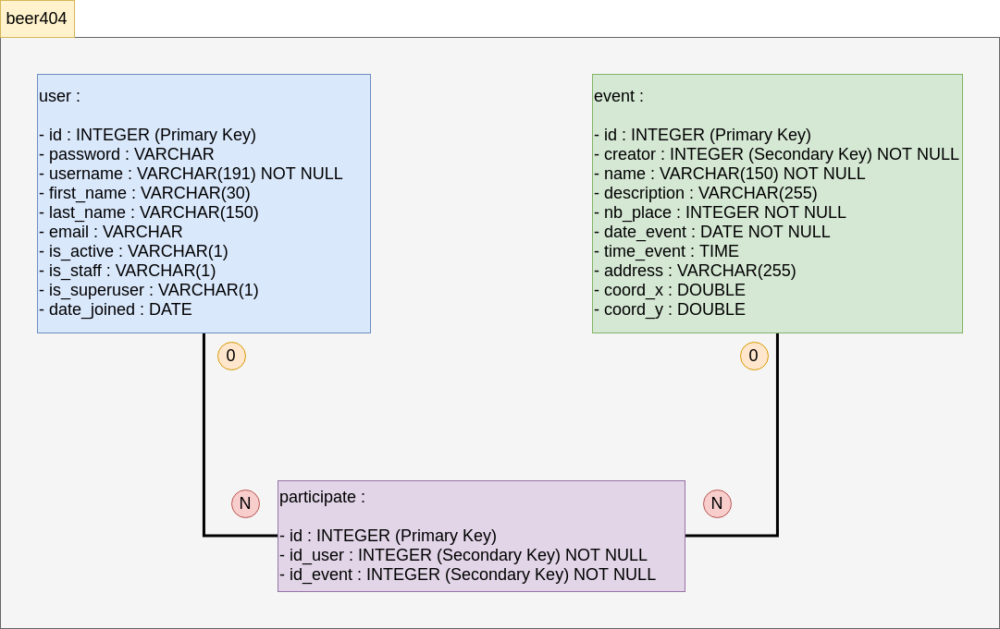

# Project Beer404 : Database

## Table Of Contents

- [Project Beer404 : Database](#project-beer404--database)
  - [Table Of Contents](#table-of-contents)
  - [Database](#database)
    - [Table List](#table-list)
    - [Table Schema](#table-schema)

## Database

- Database name : **beer404**

### Table List

- **User** : User Data
- **Events** : Events Data
- **Participate** : Users who participate to events

### Table Schema

